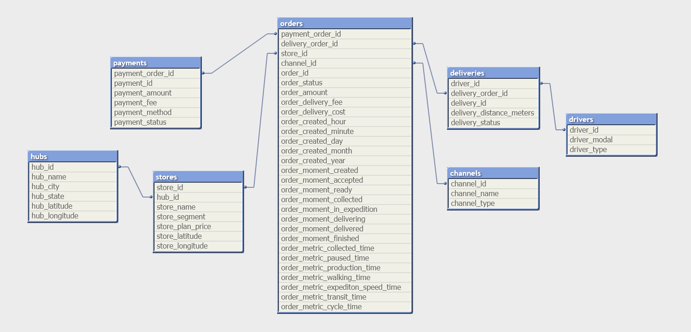

# Datalab | Delivery Center | Teste Prático 

## O que é o Delivery Center

Com seus diversos hubs operacionais espalhados pelo Brasil, o Delivery Center é uma plataforma integra lojistas e marketplaces, criando um ecossistema saudável para vendas de good (produtos) e food (comidas) no varejo brasileiro.

Atualmente temos um cadastro (catálogo + cardápio) com mais de 900 mil itens, milhares de pedidos e entregas são operacionalizados diariamente com uma rede de milhares lojistas e entregadores parceiros espalhados por todas as regiões do país. 

Tudo isso gera dados e mais dados a todo momento! 

Diante disso, nosso negócio está cada vez data driven, ou seja, utilizando dados para tomar decisões e numa visão de futuro sabemos que utilizar os dados de forma inteligente pode ser o nosso grande diferencial no mercado.

Este é o nosso contexto e com ele lhe propomos um desafio desafio em que você possa aplicar seus conhecimentos técnicos objetivando resolver problemas cotidianos de uma equipe de dados.

## Dados disponíveis

Observe na figura abaixo um modelo de dados no padrão floco de neve (snow flake). 

Este modelo representa, de forma fictícia, dados de pedidos e entregas que foram processados pelo Delivery Center entre os meses de janeiro a abril de 2021. 

Note que este é um modelo lógico e está fisicamente disponível em datasets no formato csv, ou seja, cada dataset fisicamente disponível representa uma tabela neste esquema abaixo. [Aqui estão os datasets](/datasets).

Os dados não possuem a completude de toda operação do Delivery Center e algumas informações foram anonimizadas devido ao nosso tratamento com a Lei Geral de Proteção de Dados (LGPD).

### Descrição dos datasets

* **channels:** Este dataset possui informações sobre os canais de venda (marketplaces) onde são vendidos os good e food de nossos lojistas.
* **deliveries:** Este dataset possui informações sobre as entregas realizadas por nossos entregadores parceiros.
* **drivers:** Este dataset possui informações sobre os entregadores parceiros. Eles ficam em nossos hubs e toda vez que um pedido é processado, são eles fazem as entregas na casa dos consumidores.
* **hubs:** Este dataset possui informações sobre os hubs do Delivery Center. Entenda que os Hubs são os centros de distribuição dos pedidos e é dali que saem as entregas.
* **orders:**  Este dataset possui informações sobre as vendas processadas através da plataforma do Delivery Center.
* **payments:** Este dataset possui informações sobre os pagamentos realizados ao Delivery Center.
* **stores:** Este dataset possui informações sobre os lojistas. Eles utilizam a Plataforma do Delivery Center para vender seus itens (good e/ou food) nos marketplaces.

## Desafios

### Engenharia de dados

* Desenhe e implemente uma arquitetura de dados que garanta escalabilidade do trabalho realizado. Pois, a cada dia que passa nosso volume de dados aumenta.
* Imagine que temos interesses distintos na camada de consumo de dados. Business intelligence, cientistas de dados, aplicações real time e usuários de negócio explorando dados para gerar insigths.
* Lembre-se que os datasets disponibilizados já são limitantes para o negócio e um  enriquecimento com outros dados será de grande valor para nós.
* Fique livre para criar sua própria abordagem, as dicas acima foram apenas sugestões.

### Análise e Business Intelligence

* Desenhe e implemente um conjunto de indicadores (kpi) que melhor expliquem os dados disponibilizados.
* Qual a importância e o impacto desses indicadores para o negócio?
* O que eles representam na prática, como a empresa pode utilizá-los no dia a dia e quais impactos positivos/negativos eles podem gerar?
* Existem outliers, tendências ou comportamentos nesses dados que te chamam a atenção? Quais?
* Você consegue fazer uma classificação técnica desses indicadores? Pense na estrutura da empresa (organograma)? Pense se eles são estratégicos, táticos ou operacionais? Eles representam eficiência, eficácia, efetividade, qualidade?
* Explique suas escolhas técnicas. Porque resolveu adotar a ferramenta A ou B para analisar os dados? Quais as vantagens das ferramentas que você escolheu versus outras que existem no mercado?
* Você consegue aplicar alguma técnica estatística, matemática ou de pesquisa operacional para extrair mais algum valor nesses dados?
* Fique livre para criar sua própria abordagem, as dicas acima foram apenas sugestões.

### Ciência e Modelagem de dados

* Faça um estudo exploratório dos dados. O que você descobriu sobre eles? Qual a relevância das suas decobertas para o negócio?
* Que tal aplicar técnicas de estatística ou pesquisa operacional para extrair algum valor desses dados?
* Desenvolva e implemente pelo menos 2 (duas) diferentes abordagens de modelagem de dados para resolver dois diferentes problemas. Seja criativo(a).
* Estamos interessado na sua forma científica de trabalhar. Pense nisso.
* Fique livre para criar sua própria abordagem, as dicas acima foram apenas sugestões.

## O que esperamos

* Candidatos que demonstrem um bom storytelling orientado a resolver problemas de negócio.
* Candidatos que demonstrem criatividade, organização, praticidade e objetividade na solução de problemas.
* Que um leigo seja capaz de entender suas decisões e abordagens técnicas/metodológicas.
* Que suas decisões e abordagens sejam explicáveis e tenham algum embasamento teórico.
* Candidatos com excelente "poder de síntese". O tempo está cada vez mais escasso e é importante saber resumir, sem perder de contexto dos dados.

